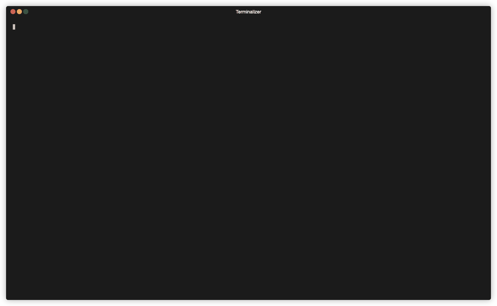

# Hilda Snippets

Snippets are extensions for normal functionality used as quick cookbooks for day-to-day tasks of a debugger.

They all use the following concept to use:

```python
from hilda.snippets import snippet_name

snippet_name.do_something()
```

For example, XPC sniffing can be done using:

```python
from hilda.snippets import xpc

xpc.sniff_all()
```

This will monitor all XPC related traffic in the given process:


